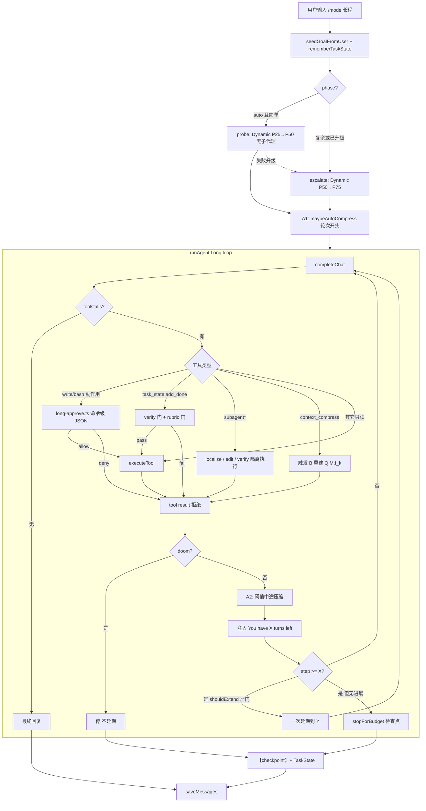
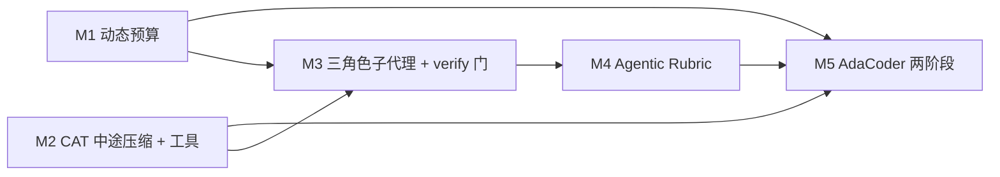

# 把五条 2026 CCF-A 机制接到 socode Long 模式

本文是**设计文档，不是实现说明**。当前仓库的 Long MVP 见 [`LONG-MODE.md`](./LONG-MODE.md)。本 PR **只新增/修改文档**，不改 `src/`。下文凡写「要加模块 / 要改循环」，一律指未来实现；落地顺序见第 9 章。

写作约定：

- **【论文事实】** 只转述原文机制、实验设定与结论，不把 socode 现状塞进去。
- **【我们的适配】** 是 socode Long 上的工程设计，可以比论文更严、更窄、更可测。
- 引用当前代码时给出真实路径与符号，以 `main` 上已有实现为准（对照 `src/mode.ts`、`src/task-state.ts`、`src/agent.ts`、`src/compress.ts`、`src/long-approve.ts`、`src/subagent.ts`、`src/subagent-plan.ts`、`src/tools.ts`、`src/index.ts`、`src/system-prompt.ts`、`src/permissions.ts`、`src/audit.ts`、`src/chat.ts`）。

五条机制分别来自：

1. More with Less（ICSE 2026）：动态回合预算
2. CAT / Context as a Tool（ACL 2026 Findings）：上下文作为一等工具
3. BOAD（ICLR 2026）+ RefAgent（ICSE 2026）：分层子代理
4. Agentic Rubrics（ACL 2026）：仓库接地的里程碑评分
5. AdaCoder（FSE 2026 Journal-First / TSE）：两阶段「先试后规划」

---

## 1. 背景与目标

### 1.1 问题

socode 已经有 Ask / Full / Plan / Long 四种 harness 模式。Long（`--mode long`、`/mode long`、`/mode 长程`，别名在 `src/mode.ts` 的 `ALIASES`）面向「做一件要跑很久的事」：记住目标、接近窗口时压缩、预算用尽时留检查点、副作用走独立 LLM 审批。它**不是 Full**：权限边界与 Ask 同类，沙箱 `confineWrites` 仍开，密钥 / 工作区外 / `sudo` 仍本地硬拒绝。

这套 MVP 足以把长任务从「Ask 每步 y/n」和「Full 盲目放行」里拆出来，但对照 2026 年几篇 CCF-A 上的 SWE agent 论文，Long 循环还缺五块可落地的控制面：

| 缺口 | 现状一句话 | 论文给的杠杆 |
| --- | --- | --- |
| 回合预算是死上限 | `DEFAULT_MAX_AGENT_STEPS = 80`，Long 用尽后 `stopForBudget` | 分位数预算 + 一次延期，而不是一上来给满 |
| 压缩只在轮次开头、只看阈值 | `maybeAutoCompress` 在 `src/index.ts` 开跑前调用 `shouldAutoCompress` | 把压缩做成可调用工具，并在工具步中间也能压 |
| 子代理角色太粗 | `explorer` / `worker`，父代理仍看见摘要文本，没有验证门 | 编排器 + 隔离子代理；localize / edit / verify 分权 |
| 验证偏软 | 提示词要求跑 `verifyCommands`，代码不强制 | 仓库接地的 rubric，与命令级审批正交 |
| 一开始就「计划→执行→验证」 | `longLoopPrompt` 固定这套 | 简单任务先试一次，失败或复杂再升级 |

### 1.2 目标

在**不把 Long 做成 Full、不引入 MCP、不要求先训模型**的前提下，给出一套可以按里程碑落地的 harness 设计：

1. 动态回合预算（比论文更严的 `shouldExtend`）。
2. 未训练的 CAT MVP：`context_compress` 工具 + 被动阈值 + **循环内**压缩。
3. 手写三角色子代理（localize / edit / verify），硬隔离；BOAD 的 bandit 只作后续工作。
4. 里程碑级 Agentic Rubric，失败即关，与 `long-approve.ts` 的命令级审批分工。
5. AdaCoder 式两阶段状态机，和预算、子代理共用同一套 TaskState。

### 1.3 非目标（整份文档共用）

- 不在本设计里改 Ask / Full / Plan 的权限语义。
- 不把 Long 的 LLM 审批器换成用户 y/n，也不取消审批。
- 不把 CAT 的 SFT（CaT-Generator / SWE-Compressor）当作 MVP 前置。
- 不把 BOAD 的 UCB / CRP / 自动发现子代理当作 MVP 前置。
- 不引入新的数据库表。状态继续活在 `messages.payload` 旁的 `【task state】` system 文本里（见 `src/task-state.ts` 的 `TASK_STATE_PREFIX`）。
- 不保证与 SWE-bench 数字可复现。论文数字只用来解释机制，socode 默认用 `--steps` 的分位比例。

---

## 2. 与当前 socode Long 的差距

对照必须钉在真实文件上。下面按「循环骨架 → 状态 → 压缩 → 预算 → 审批 → 子代理 → 提示词」写差距，后面五章不再重复铺垫。

### 2.1 循环骨架

入口在 `src/index.ts`：解析 `--mode` / `MODE`，`loadMode`（`src/mode.ts`）得到 `AgentMode`。Long 会话里：

1. 用户输入后，若 `mode === "long"`，先 `maybeAutoCompress(session.messages)`。
2. `tasks.replace(seedGoalFromUser(tasks.get(), prompt))`，空 goal 时把第一句有效用户输入当成目标。
3. `rememberTaskState` 把最新 TaskState 写成 `role=system` 且以 `【task state】` 开头的消息。
4. `ask()` 调 `runAgent`（`src/agent.ts`），`maxTokens` 与 `maxContextTokens` **只在 Long 传入**。
5. 跑完 `saveMessages`，再 `rememberTaskState`。Esc 中止走 `checkpointReply(..., "abort")`。

`runAgent` 本身是标准 ReAct：每步 `completeChat` → 若有 `toolCalls` 则 `executeTool` → 把 assistant / tool 消息推进 `messages` 与 `trace`。Doom loop：同一 `name\0arguments` 连续 `REPEAT_LIMIT = 3` 次，或同一工具名连续失败 3 次，则停并回复「检测到重复或连续失败的工具调用」。Long 在每轮工具执行后额外看 `budgetStopReason`；tokens / context 用尽则 `stopForBudget`，**不抛**「超过最大工具步数」。Ask / Full / Plan 步数用尽仍 `TurnFailed`。

**差距：** 循环内没有「预算提醒」「一次延期」「主动压缩工具」「强制验证门」「阶段（phase）」。压缩发生在 **用户轮次开始前**，不是 agent 工具步中间。`docs/LONG-MODE.md` 阶段 3 已写明「循环内压缩」是后续项。

### 2.2 TaskState

`src/task-state.ts` 的类型：

```ts
type TaskState = {
  goal: string;
  milestones: string[];
  done: string[];
  failures: string[];
  keyFiles: string[];
  verifyCommands: string[];
  notes: string;
  updatedAt: string; // ISO
};
```

更新路径：工具 `task_state`（仅 Long 且非 nested，见 `toolSpecs`）、用户 `/task`、以及预算停 / 中止时 `patch({ notes })`。列表上限 `MAX_LIST = 40`，文本截断 `MAX_TEXT = 2000`。检查点前缀 `【checkpoint】`，原因枚举 `CheckpointReason = "budget" | "abort" | "milestone" | "manual" | "compress"`。

**差距：** 没有 `phase`、`turnBudget`、`extensionsUsed`、`verifyRubric`、`lastVerify`、`subagentSummaries`。里程碑「完成」只是模型自己 `add_done`，runtime 不核对 `verifyCommands` 是否真跑过、是否退出码为 0。

### 2.3 压缩

`src/compress.ts`：

- `splitForCompress`：按用户轮切，保留最近 `KEEP_USER_TURNS = 2` 轮；把 `lastHarnessMode` 与 `lastTaskState` **钉进 keep**；stale 里丢掉 pinned system。
- `shouldAutoCompress`：`canCompress`（stale tokens ≥ `MIN_STALE_TOKENS = 1200`）且（`droppedCount > 0` **或** `used/window ≥ LONG_COMPRESS_RATIO = 0.82` **或** `free` 很小）。
- `compressHistory`：另开一次 `completeChat` 做中文摘要，前缀 `【会话摘要】`（`COMPRESSED_PREFIX`，定义在 `src/context.ts`）。

触发点只有 `src/index.ts` 的 `maybeAutoCompress`（Long 专属）和用户 `/compress`。`runAgent` **不会**在 `for (let step ...)` 里压缩。上下文顶满时 Long 走 `budgetStopReason` 的 `"context"`，留检查点，**下一轮开头**再压。

**差距：** 这是 CAT 论文里的 Threshold-Compression 基线：被动、阈值、轮次边界。没有「上下文作为工具」，没有里程碑处主动折叠，没有循环内压缩。

### 2.4 预算

- 步数：`--steps` / `MAX_AGENT_STEPS` / 默认 80（`DEFAULT_MAX_AGENT_STEPS`）。
- Token：`--budget` / `MAX_AGENT_TOKENS`，仅 Long 传给 `runAgent.maxTokens`。
- 上下文：`contextBudget()` = `(contextWindow - maxOutput - 256) * 0.9`，仅 Long 传 `maxContextTokens`。
- `budgetStopReason` 优先级：tokens → context → steps。
- Long 停的时候写 `checkpointReply`，并在 notes 末尾追加 `checkpoint: ${reason}`。

**差距：** 预算是固定硬顶。没有「还剩 X 步」的环境提醒，没有 Dynamic X→Y，没有基于进度的延期门。论文里的「没产出 patch 就延期」在 socode 里甚至没有「patch」这个对象——Long 是交互式仓库编辑，不是 SWE-bench 提交。

### 2.5 命令级审批

`src/long-approve.ts`：副作用若通过本地硬拒绝，发起**全新、无历史**的 LLM 调用。只给工具名、截断参数、`mode: long`、workspace、TaskState.goal。输出必须是 JSON `{ allow: boolean, reason: string }`（中文键等价）。解析失败、超时（`LONG_APPROVE_TIMEOUT_MS = 12_000`）、缺 Provider、缺 `longApprove` hook，一律 deny。审计写 `.socode-audit.jsonl`（`src/audit.ts` 的 `writeAudit`），控制台一行 `long-approve allow|deny`。

`src/permissions.ts` 的 `decide`：`mode === "long"` 走 `longSideEffect`；Ask 走用户 y/n；Full 直接允许（仍受 `mutationDenied`）。explorer 子代理禁止 write/delete 和非只读 bash。

**差距：** 这是**单次工具调用**的门，不是里程碑质量门。模型可以把一堆小写都审批通过，却交付一个偏题、扩 scope、削弱测试的里程碑。Agentic Rubrics 补的是后者。

### 2.6 子代理

已有实现：

- 规划：`subagent_plan`，1–6 个 job，`kind = explorer | worker`（`src/subagent-plan.ts`，`MAX_SUBAGENTS = 6`）。
- 执行：`subagent` → `createSubagentRunner` → `runSubagent`（`src/subagent.ts`）。子代理 `messages` 只有 `buildSubagentPrompt` + 用户 prompt，**没有父对话**。`max_depth = 1`（`policy.nested` 时 `toolSpecs` 去掉两个子代理工具，`authorize` 也拒）。
- 权限：`childPolicy` 调 `createPolicy(..., { nested: true, role: kind })`。explorer 只读工具集 `READ_TOOLS`。
- 默认步数 `DEFAULT_SUBAGENT_STEPS = 24`，可用 `SUBAGENT_STEPS`。
- 返回：`formatSubagentResult` / `formatSubagentBatch`，纯文本摘要，截到 `MAX_SUBAGENT_REPLY = 6000`。
- Plan 模式不能派生子代理。Long / Ask / Full 可以。

**差距：** 角色只有「只读探索 / 可写执行」。没有 localize / edit / verify 的返回 schema，没有「编排器只看见 TaskState + 摘要」的强制裁剪（父代理 trace 里仍是整段 `[subagent ...]` 文本），没有「verify 通过才能 `add_done`」，没有「edit 必须走 long-approve」之外的额外隔离（worker 已经走父 policy 的审批，但父代理仍可自己 write）。BOAD 强调的「无共享脏历史、只传 context 参数」目前只做到一半：子代理确实干净，但编排器仍把子代理输出当可信事实。

### 2.7 提示词与工具表

`src/system-prompt.ts` 的 `longLoopPrompt` 要求：search → read → 小改；里程碑后跑 `verifyCommands`；用 `task_state` 记账；禁止 doom loop。`modeRules("long")` 同样强调审批器与检查点。工具列表在 Long 下包含 `task_state`、`subagent_plan`、`subagent`。

**差距：** 提示词是软约束。没有 `context_compress` 工具，没有 phase 字段，没有「未验证不得标记 done」。

### 2.8 提示缓存

`src/chat.ts` 的请求体是 `model` / `messages` / `max_tokens` / 可选 `reasoning_effort` / `tools`。**没有** `prompt_cache`、`cache_control`、Anthropic cache breakpoint、OpenAI `prompt_cache_key` 一类字段。因此后文 CAT 适配里「压缩与 prompt cache 的关系」必须写清楚：当前实现无 cache，压缩不会打坏 cache；若未来在 `completeChat` 加 cache，循环内压缩会主动失效前缀 cache，需要策略。

### 2.9 一句话对照

当前 Long = **Ask 权限边界 + 轮次开头阈值压缩 + 固定预算检查点 + 命令级 JSON 审批 + 可选 explorer/worker 子代理**。五条论文机制分别补：预算怎么长、上下文怎么管、子任务怎么拆、里程碑怎么验、简单任务要不要先规划。

---

## 3. 机制一：More with Less — 动态回合预算

### 3.1 原文机制

**【论文事实】** Gao & Peng, *More with Less: An Empirical Study of Turn-Control Strategies for Efficient Coding Agents*，ICSE 2026 Research Track。在 SWE-bench 上用 Claude 4 Sonnet、Gemini 2.5 Pro、GPT 4.1 比较三种回合控制。脚手架接近 Trae / SWE-agent：每回合 LLM 调工具，直到 `task_done` 或停。

#### 3.1.1 三种策略

1. **Unlimited-Turn Agent（基线）**  
   无回合上限，直到任务完成或自己停。用来量「无约束时每个模型解一道题要多少回合」，并得到分位数。论文 Table 2（100 题规模下的分位）：

   | 模型 | Solve rate | 25th | 50th | 75th |
   | --- | ---: | ---: | ---: | ---: |
   | Claude 4 Sonnet | 75% | 44 | 52 | 63.75 |
   | Gemini 2.5 Pro | 63% | 19 | 28.5 | 44.5 |
   | GPT 4.1 | 62% | 38.75 | 49.5 | 66.25 |

   无单一模型同时最优：Claude 最能解，Gemini 回合最少，GPT 4.1 最便宜。

2. **Fixed-Turn Agent with Reminder**  
   硬上限取基线分布的 25 / 50 / 75 分位。每步在工具结果后追加提醒，原文句式：

   > `ENVIRONMENT REMINDER: You have X turns left to complete the task.`

   到上限即终止，不延期。

3. **Dynamic-Turn Agent with Reminder and Growth（Dynamic X→Y）**  
   先给 X（例如 25 分位）。若在 X 内**没有生成 patch**，一次性加缓冲，使总上限变成 Y（例如 50 分位），并追加：

   > `ENVIRONMENT REMINDER: You have used up all turns but have not yet completed the task. You are granted an additional X turns to continue and complete the task.`

   论文定义：「If it fails to generate a patch within this initial budget, it receives more turns」。延期条件是 **预算耗尽且尚无 patch**，**不是**「验证有进展」。这是后文我们要故意改严的点。

   Claude 的例子：Dynamic 25→50 表示先给 44 步（25 分位）；若无 patch，再给 8 步，总上限 52（50 分位）。

#### 3.1.2 主要结论（论文数字，不是 socode 承诺）

- **75 分位是 sweet spot**：相对 Unlimited，成本降 24%–68%，solve rate 几乎不掉。Gemini 2.5 Pro 在 75 分位甚至 solve rate **升** 3.17% 同时成本降约 68%——论文解释为截止日期减少空转。
- 25 分位对所有模型都明显掉点。
- **Dynamic 25→50 vs Fixed 50**：同等或更好的 solve rate，额外省成本（论文摘要给出 Claude 15.56%、Gemini 5.95%、GPT-4.1 24.30% 量级）。
- **Dynamic 50→75 vs Fixed 75**：再省 12%–24%，solve rate 相当或更好。
- 提醒文本本身是一等公民：urgency 改变行为，不是「静默 cap」。

#### 3.1.3 论文明确没做的

延期门非常粗：有没有 patch。没有看测试是否变绿、里程碑是否前进、是否 doom loop。SWE-bench 的「patch」是可提交 diff；交互式助手没有这个对象。

### 3.2 与 Long 的关系

**【我们的适配 · 对照】**

| 论文概念 | socode 现状 | 适配对象 |
| --- | --- | --- |
| turn | `runAgent` 的 `step`（一次 completeChat，可能含一批 toolCalls） | 继续用 step，不另造「用户回合」预算 |
| Unlimited | 实际是 Fixed 80（或 `--steps`），无提醒 | 保留作为 `LONG_BUDGET_POLICY=unlimited` 调试开关 |
| Fixed+Reminder | 有 cap 无 reminder | 每步工具结果后注入 reminder 消息 |
| Dynamic X→Y | 无 | 默认策略 |
| patch | 无 | **不**用 git diff 当延期条件；改用更严的进度信号 |
| 分位数 | 无 SWE-bench 轨迹库 | 用 `--steps` 的比例模拟 P25/P50/P75，允许环境变量覆盖 |

当前挂钩点已经很清楚：

- 步数硬顶：`runAgent` 的 `maxSteps`，Long 用尽走 `stopForBudget("steps")`（`src/agent.ts` 约 216–241、248–269 行）。
- 注入提醒：工具结果写入 `messages` 之后、下一轮 `completeChat` 之前。
- 延期：本来要 `return stopForBudget(...)` 的地方，先问 `shouldExtend`。

Token / context 预算**不**套用 Dynamic X→Y。论文研究对象是 turn count；token 平方增长是他们要控 turn 的原因，不是他们的延期单位。socode 的 `maxTokens` / `maxContextTokens` 仍按现逻辑硬停，停前若已能压缩则走 CAT（第 4 章），不能压再检查点。

### 3.3 详细设计

#### 3.3.1 预算对象与分位

对一次 Long **用户轮**（一次 `ask()` / 一次 `runAgent` 调用）：

```
P100 = maxSteps          // --steps 或 MAX_AGENT_STEPS 或 80
P75  = ceil(P100 * 0.75) // 默认 60
P50  = ceil(P100 * 0.50) // 默认 40
P25  = ceil(P100 * 0.25) // 默认 20
```

允许绝对覆盖：`LONG_BUDGET_P25` / `LONG_BUDGET_P50` / `LONG_BUDGET_P75`（正整数，且必须 `P25 < P50 ≤ P75 ≤ P100`）。没有本地轨迹库之前，**不要**假装这些数字来自 socode 自己的 75 分位。以后若收集匿名步数直方图，可以换成经验分位，但那是遥测，不是 MVP。

策略枚举 `LongBudgetPolicy`：

- `unlimited`：行为与现在几乎相同，但可选仍打 reminder（默认关）。
- `fixed`：硬顶 `P75`（sweet spot），带 reminder，不延期。
- `dynamic`（默认）：`Dynamic P50→P75`。简单任务可被 AdaCoder 降成 `Dynamic P25→P50`（第 7 章）。

默认选 Dynamic 50→75 而不是 25→50，因为 socode 的「一步」常常含多次工具，25% 对仓库级任务过狠；论文也指出 25 分位会掉点。25→50 留给 AdaCoder Phase-1 或用户显式收紧。

#### 3.3.2 Reminder 注入

在 `runAgent` 每次成功执行完本步全部 tool 结果之后（doom 停之前），若 `policy.mode === "long"` 且策略不是静默 unlimited：

```
remaining = currentCap - (step + 1)
```

向 `messages`（**不要**写入持久化 `trace` 里的用户可见回复，或写入 trace 但带内部标记，避免污染会话摘要）追加一条 `role=user` 或 `role=system` 的环境消息。推荐 `role=system`，前缀 `【turn budget】`，与已有 `【harness mode】` / `【task state】` 一致：

```
【turn budget】ENVIRONMENT REMINDER: You have {remaining} turns left to complete the current Long run. 当前 cap={currentCap}，已用={step+1}，策略={policyName}。
```

中英混排是有意的：论文发现英文 reminder 有效；socode 系统提示是中文。固定英文套话便于以后对照论文，后面跟中文状态避免模型忽略。

压缩时：`splitForCompress` 应把 `【turn budget】` 视为 **不可进 keep 的瞬时消息**（只对「下一模型调用」有意义）。否则摘要会充满过期的 “You have 3 turns left”。实现时在 `isPinnedControl` 旁加 `isEphemeralControl`，stale/keep 都丢掉最新一条之前的预算提醒，只保留**当前**这条（若仍在本轮）。

#### 3.3.3 比论文更严的 shouldExtend

**【论文事实】** 延期 = 用尽 X 且还没有 patch。

**【我们的适配】** 延期必须同时满足下面全部条件（全部为真才 `allow`）。任一失败则按现逻辑 `stopForBudget`。

```
shouldExtend(run, state) :=
    run.policy ∈ {dynamic}
    AND run.extensionsUsed < LONG_BUDGET_MAX_EXTEND   // 默认 1，论文是 one-time
    AND run.step >= run.currentCap
    AND run.currentCap < run.hardCap                  // hardCap = Y
    AND NOT run.doomStopped
    AND NOT run.verifyClosedFail                      // 见 Rubric / verify 门
    AND hasProgress(run, state)
    AND notSpinning(run)
```

`hasProgress`（三者满足其一，且必须是**本段预算**内发生的，不是历史 done 里早已存在的）：

1. **验证前进：** 本段内至少一次 `bash` 执行了 `state.verifyCommands` 中的某条，且工具结果**不是** `isToolError`（`src/tool-ui.ts`）。若还没有 `verifyCommands`，不能靠这条。
2. **里程碑前进：** `done` 集合相对本段开始时**严格增大**，或 `milestones` 有新项被勾到 done。注意：仅 `task_state` 改 notes / 把同一句话换种写法不算。
3. **工作区实质编辑：** 本段内至少一次 `write`（或审批通过的副作用 bash 且命令像编辑器）成功，且路径落在 `keyFiles` 或本段 `task_state.add_key_file` 新登记的路径。纯 `search`/`read` 不算。

`notSpinning`：

- 本段未触发 `REPEAT_LIMIT` doom。
- 本段失败工具次数 / 总工具次数 < `LONG_BUDGET_FAIL_RATIO`（默认 0.5）。
- 最近 `K=6` 次工具不全是 `read`/`search`/`get_current_time`/`calculate`（防止「一直看、从不做」刷进度）。

明确**拒绝**当进度的信号：

- 只有 goal 被 seed、没有任何工具。
- 只有被 long-approve deny 的 write。
- 模型声称「再给我点时间就能做完」但 `hasProgress` 为假。
- git diff 非空但全是无关文件（可用 `keyFiles` 约束；keyFiles 为空则退化为「至少一次成功 write」）。

这比论文严格的原因：socode 没有隐藏测试来告诉你 patch 对不对；「再给 8 步」很容易变成空转烧钱。延期是对**已证明在推进**的任务的追加投资，不是安慰奖。

#### 3.3.4 延期发生时

1. `run.currentCap = min(run.hardCap, run.currentCap + (Y - X))`；对 50→75 即一次加到 P75。
2. `run.extensionsUsed += 1`。
3. 注入延期 reminder（论文句式 + 中文）：
   `【turn budget】ENVIRONMENT REMINDER: You have used up all turns but have not yet completed the task. You are granted an additional {delta} turns. 延长条件：本段有验证/里程碑/有效写入进展，且非空转。新 cap={currentCap}。`
4. `tasks.patch({ notes })` 记一行 `budget-extend: ${from}→${to} because ${reason}`。
5. `writeAudit({ tool: "turn_budget", decision: "allow", detail: ... })`。
6. **不**对用户打 `【checkpoint】`。检查点只在最终拒绝延期或硬顶用尽时出现。
7. 继续 `for` 循环，不新开 `runAgent`（避免丢失本轮 messages）。

#### 3.3.5 失败 / 检查点 / 与压缩的关系

- **拒绝延期或 Y 用尽：** 走现有 `stopForBudget("steps")` → `checkpointReply` → notes 追加 `checkpoint: steps`。用户同一会话下一轮 `ask()` 是一次**新的** `runAgent`，预算从 X 重新计。是否把「上一轮已延期过」带到下一用户轮：默认**不带**。每轮用户输入是新的投资决策。若同一 goal 连续 N 轮（默认 3）都在 steps 检查点结束且 `done` 无增长，提示词应建议缩小范围或 `/mode ask`，但不自动再延期。
- **tokens / context 用尽：** 不走 shouldExtend。若 CAT 已落地，先尝试循环内压缩再决定是否 context-stop（第 4 章）。压缩成功则 step 计数**不重置**（论文的 turn 是决策步，不是 token）。
- **用户 Esc：** 现逻辑 `TurnAborted` + `checkpointReply(..., "abort")`。不延期。
- **doom loop：** `shouldExtend` 为假。宁可检查点，不要奖空转。

#### 3.3.6 挂钩位置（未来改 `src/agent.ts`）

伪代码嵌在现有循环上，不另起一个 agent：

```
// runAgent，longHorizon === true
currentCap = policy.longBudget?.x ?? maxSteps
hardCap    = policy.longBudget?.y ?? maxSteps
extUsed    = 0
progress   = snapshot(policy.tasks.get())

for step in 0..maxSteps-1:          // 循环上界仍用 hardCap；currentCap 是软顶
    if step >= currentCap:
        if shouldExtend(...):
            currentCap = hardCap
            extUsed += 1
            messages.push(extendReminder)
            audit(extend)
        else:
            return stopForBudget("steps", ...)

    allowTools = tools && step < hardCap - 1   // 最后一步仍禁止工具，与现逻辑一致
    result = completeChat(...)
    if no toolCalls: return final reply

    execute tools, update progress counters, maybe doom-stop

    if longHorizon:
        messages.push(turnsLeftReminder(currentCap - step - 1))
        reason = budgetStopReason(tokens/context)  // 不含 steps；steps 由 currentCap 管
        if reason in {tokens, context}:
            return stopForBudget(reason, ...)
```

现有 `budgetStopReason` 把 steps 和 tokens/context 混在一个函数里。适配时建议拆成 `resourceStopReason`（tokens/context）与 `stepCap`（动态 cap），避免 `maxSteps + 1` 那种为了「工具步内先别因 steps 停」的偏置（见当前 `src/agent.ts` 里 `maxSteps: maxSteps + 1` 的调用）。这是一次小重构，行为对 Ask/Full/Plan 必须保持：它们仍然在 `step >= maxSteps` 时抛错。

`Policy`（`src/permissions.ts`）可加只读字段 `longBudget?: { x: number; y: number; policy: LongBudgetPolicy }`，由 `src/index.ts` 在创建 policy 时从 CLI/env 填入，避免 `runAgent` 读 `process.env`。

### 3.4 伪代码：shouldExtend

```
function hasProgress(segment, startState, nowState):
    verifyHit = segment.successfulVerifyCmd >= 1
    milestoneHit = nowState.done.length > startState.done.length
                   OR newDoneItems(startState.done, nowState.done)
    writeHit = segment.successfulWrites >= 1
               AND (startState.keyFiles empty OR writePath in nowState.keyFiles)
    return verifyHit OR milestoneHit OR writeHit

function notSpinning(segment):
    if segment.doomTriggered: return false
    if segment.toolCalls >= 4 AND segment.failRatio >= 0.5: return false
    if lastN(segment.tools, 6).every(t => t in READ_TOOLS): return false
    return true

function shouldExtend(run, segment, startState, nowState):
    if run.policy != "dynamic": return {allow: false, reason: "非 dynamic 策略"}
    if run.extUsed >= 1: return {allow: false, reason: "已延期一次"}
    if run.doomTriggered: return {allow: false, reason: "doom loop"}
    if run.verifyClosedFail: return {allow: false, reason: "验证门已关闭"}
    if not hasProgress(...): return {allow: false, reason: "本段无验证/里程碑/有效写入"}
    if not notSpinning(...): return {allow: false, reason: "空转或失败率过高"}
    return {allow: true, reason: progressReason(...)}
```

### 3.5 配置项

| 项 | 默认 | 含义 |
| --- | --- | --- |
| `LONG_BUDGET_POLICY` | `dynamic` | `unlimited` / `fixed` / `dynamic` |
| `--steps` / `MAX_AGENT_STEPS` | 80 | P100 |
| `LONG_BUDGET_P25/P50/P75` | 0.25/0.50/0.75 × P100 | 可改为绝对整数 |
| `LONG_BUDGET_DYNAMIC` | `50-75` | 或 `25-50` |
| `LONG_BUDGET_MAX_EXTEND` | 1 | 论文 one-time；>1 非目标 |
| `LONG_BUDGET_FAIL_RATIO` | 0.5 | 延期拒绝阈值 |
| `LONG_BUDGET_REMINDER` | `true` | 关闭则退回静默 cap（不推荐） |
| `--budget` / `MAX_AGENT_TOKENS` | 无 | 仍硬停，不延期 |

CLI：不必新 flag。文档约定用环境变量；若以后要 CLI，再用 `--budget-policy`。`--steps` 继续表示硬顶 Y。

### 3.6 测试计划

新文件建议 `src/long-budget.test.ts`（未来实现）。用假 `completeChat` 驱动 `runAgent`，不要打真实网。

1. **Reminder 文本：** 固定 cap=4，跑 2 步有工具的循环，断言 messages 里出现 `You have X turns left`，且 X 递减。
2. **Fixed 不延期：** policy=fixed，X=Y=3，第 3 步后 `stopped === "steps"`，无延期 reminder。
3. **Dynamic 有进展则延期：** 模拟在 X 内一次成功 `write` + `task_state add_done`，断言进入 Y，出现 granted additional turns，最终可在 Y 内正常停。
4. **Dynamic 无进展不延期：** X 内只有 `read`/`search`，断言直接 checkpoint，`extensionsUsed=0`。
5. **Doom 不延期：** 连续三次同调用，即便 `done` 被模型改过也不延期（进度伪造 vs doom：doom 优先）。
6. **Token 预算不走 shouldExtend：** `maxTokens` 先触达，`stopped === "tokens"`。
7. **Ask 模式不受影响：** `policy.mode !== "long"` 时无 reminder、步数用尽仍抛错（现 `agent.test.ts` 的 `budgetStopReason` 单测保留）。
8. **分位校验：** P25≥P50 或 P75>P100 时启动失败（`index` 解析）或回退默认并打日志。
9. **检查点内容：** 拒绝延期后的 reply 仍以 `【checkpoint】` 开头，含 goal 与下一步（复用 `checkpointReply`）。
10. **Reminder 不进压缩 keep：** 给 `splitForCompress` 一串预算消息，keep 里最多一条当前提醒。

### 3.7 风险与非目标

- **风险：模型把 reminder 当用户指令。** 缓解：system 角色 + 固定前缀；压缩丢掉历史提醒。
- **风险：模型用假 `add_done` 骗延期。** 缓解：`hasProgress` 要求 done **集合变大**且最好同时有 write/verify；后续 Rubric 落地后，未评分通过的 done 可回滚（第 6 章）。MVP 预算章先接受「done 增长」这条较弱信号，但 doom/空转仍挡住。
- **风险：一步多 toolCall 让「turn」比论文更胖。** 接受。socode 的并行工具是特性；不把一个 toolCall 算一 turn。
- **非目标：** 按模型品牌自动换分位表；多段延期；把 token 当 turn 来延期；为了对齐论文去跑 SWE-bench。

---

## 4. 机制二：CAT / Context as a Tool

### 4.1 原文机制

**【论文事实】** Liu et al., *Context as a Tool: Context Management for Long-Horizon SWE-Agents*（文中写作 Cat / CAT），ACL 2026 Findings。针对长程 ReAct 的 append-only 上下文爆炸与语义漂移。

#### 4.1.1 结构化工作区

时刻 t 的工作上下文：

\[
C(t) = \bigl(Q,\; M(t),\; I^{(k)}(t)\bigr)
\]

- **Q**：不可压缩段。系统提示 + 关键用户目标。初始化且始终保留原文。
- **M(t)**：历史轨迹的高保真摘要（长期记忆）。通过上下文管理工具更新。
- **I^(k)(t)**：最近 k 个 ReAct 交互的完整记录（短期工作记忆）。

初始化 \(C(1)=(Q,\emptyset,\emptyset)\)。

#### 4.1.2 上下文作为一等工具

压缩不是外挂启发式，而是和 `edit` / `bash` 同级的可调用动作。模型在一步里决定：现在是该改文件，还是该把历史折进 M。论文观察到的主动触发点（启发式，不是固定阈值）：

- 子任务完成，需要阶段性总结；
- 轨迹已经很长，继续留原文不划算；
- 后续推理更需要结构化摘要而不是原始日志；
- 反复失败后出现新方向（error-correction 边界）。

插入压缩后，工具的 Observation 就是新的 \(M(a_i)\)，最近 k 步仍原文保留。

#### 4.1.3 相对 Threshold-Compression

论文基线 **Threshold-Compression**（OpenHands 一类）：只有上下文长度超过阈值才压；压的时候同样保留 system+意图+最近 k 步、摘要其余。CAT 的主张是：**阈值只是后盾，真正的收益来自里程碑处主动折**。实验里 SWE-Compressor（32B，经 CaT-Instruct SFT）在 SWE-Bench-Verified 上 57.6%，同数据预算下超过 ReAct 与 Threshold-Compression。

#### 4.1.4 训练管线（CaT-Generator）——明确标成可选

离线两阶段：先生成**不含压缩**的完整 ReAct 轨迹，再在候选点插入 condenser 动作，Observation 填结构化摘要，经拒绝采样得到 CaT-Instruct（约 20k），SFT 出 SWE-Compressor。另有 20k Base-Instruct 不含压缩技能。

**【论文事实】** 最好的数字来自训过的模型。  
**【我们的适配】** socode MVP **不训练**。用提示词 + 工具 schema 让现有模型调用 `context_compress`；质量会弱于 SWE-Compressor，但 harness 先闭环。训练是后续可选工作，不阻塞 M2。

### 4.2 与 Long 的关系

当前 Long 几乎就是论文的 Threshold-Compression 基线：

- 被动阈值：`shouldAutoCompress` + `LONG_COMPRESS_RATIO = 0.82`。
- 保留最近 2 个**用户轮**（不是 2 个 ReAct 步）。CAT 的 k 是 ReAct interactions；socode 的 `KEEP_USER_TURNS = 2` 更粗。
- Q 的近似：`splitForCompress` 已把最新 harness mode 与 TaskState 钉进 keep；`buildSystemPrompt` 每轮重算，Q 里的系统提示其实每次请求都在 `buildApiMessages` 的 system 位，不依赖历史。
- M 的近似：`【会话摘要】` 用户消息。
- 没有工具、没有循环内压缩、没有里程碑触发。

`docs/LONG-MODE.md` 阶段 3 已点名「工具步中间调用现有 compress」。CAT 适配就是把阶段 3 写具体，并加上主动工具这一面。

### 4.3 详细设计（未训练 MVP）

#### 4.3.1 工具 schema：`context_compress`

仅 Long、且仅父代理（`toolSpecs`：`mode === "long" && !opts?.nested`）。子代理默认**不**给这个工具，避免子代理压缩自己那一小段干净上下文（它们步数少、历史短）。若 verify 子代理以后要跑很久，再单独开；MVP 不开。

```json
{
  "name": "context_compress",
  "description": "把当前 Long 会话里较早的工具轨迹折成摘要。系统提示、【harness mode】、【task state】和最近 k 个 ReAct 步会保留原文。只在里程碑边界、策略转向、或上下文变挤时调用。不要连着压。",
  "parameters": {
    "type": "object",
    "properties": {
      "reason": {
        "type": "string",
        "description": "为何现在压：milestone | strategy_switch | context_pressure | error_correction"
      },
      "keep_turns": {
        "type": "integer",
        "description": "保留最近多少个 ReAct 步（assistant+其 tool 结果算 1 步）。默认 4，范围 2–8。"
      },
      "note": {
        "type": "string",
        "description": "希望摘要特别保留的要点（路径、失败原因）。可选。"
      }
    },
    "required": ["reason"]
  }
}
```

`execute` 不走普通 `tools[]` 里的无上下文 stub，而像 `task_state` 一样需要 `policy` 会话上下文。建议在 `Policy` 上挂 `compressNow?: (opts) => Promise<string>`，由 `src/index.ts` 闭包实现，内部调 `compressHistory`。

返回给模型的 tool 结果应短：

```
[context_compress] ok  reason=milestone  saved≈1234 tokens  keep=4
摘要已写入会话（【会话摘要】）。TaskState 与 harness mode 仍钉在原文。继续当前 goal，不要重做 done。
```

失败 fail-closed（压缩器没吐摘要、对话不够长、信号中止）：返回 `工具执行失败: ...`，**不**改 messages。现有 `compressHistory` 在 stale 太短时抛「对话还不够长，无需压缩」——工具层应把它变成友好错误，而不是让 `runAgent` 当成 TurnFailed。

#### 4.3.2 Rebuild 规则（对齐 C=(Q,M,I_k)）

压缩后的消息必须能重建为：

| 段 | 来源 | 规则 |
| --- | --- | --- |
| Q | `buildSystemPrompt(...)` + 最新 `harnessModeMessage` + 最新 `taskStateMessage` | 原文，永不进 summarizer 输入 |
| M | 0..n 条 `【会话摘要】`；MVP 只保留**最新一条**，更旧的摘要并进这一次 stale 再压 | 摘要文本；`note` 参数写入 summarizer 的 user 提示 |
| I^(k) | 最近 k 个 ReAct 步（从尾部数：一组 assistant(toolCalls)+后续 tool 消息 = 1） | 原文；k 默认 4，工具可调 2–8 |

与当前 `splitForCompress` 的差异：

1. 切分单位从「用户轮」改为「ReAct 步」。Long 一轮用户可能对应几十个 ReAct 步；按用户轮保留 2 轮会把大量工具垃圾留在 I 里。**只在 `context_compress` 与循环内自动压时用 ReAct 切分**；用户手动 `/compress` 可继续用旧的用户轮切分，减少行为惊喜。
2. Q 继续钉 TaskState / harness mode（已有测试 `compress.test.ts`：「pins the latest TaskState and harness mode into keep」必须仍然通过）。
3. 瞬时消息（`【turn budget】`）不进入 Q/M/I。
4. `goal` 已在 TaskState 与 system 的 `longLoopPrompt` 里。不要把用户第一句再摘要一遍当 Q——避免双份。

`compressHistory` 的 system 提示可加一句 Long 专用：保留 goal、done、failures、keyFiles、verifyCommands、未验证的改动路径；丢掉重复 search 输出。不必分叉成两个 summarizer 文件，用可选 `mode: "long"` 参数即可。

#### 4.3.3 双触发：被动阈值 + 主动工具

```
触发 A（被动，安全网）
  条件：shouldAutoCompress 仍为真
  时机：
    (1) 现有：用户轮开始前 maybeAutoCompress
    (2) 新增：runAgent 每步工具执行后，若 pressure 达标则内部调用同一 compress 路径
  发起者：runtime，不消耗「模型决定」

触发 B（主动，CAT）
  条件：模型调用 context_compress
  时机：任意工具步（与 write/bash 同级）
  发起者：模型
```

**中途压缩是硬要求。** 若只做触发 B 而 A(2) 不做，模型若从不调工具，行为退回今天的「顶满 → context 检查点 → 下一用户轮再压」。论文认为被动阈值不够；但未训练模型可能很少主动调工具，所以 A(2) 必须存在。

A(2) 节流：

- 两次压缩至少间隔 `LONG_COMPRESS_MIN_STEPS = 8` 个 ReAct 步。
- 一次压缩 `saved` tokens < `MIN_STALE_TOKENS` 则本轮不再自动压。
- 正在执行 `context_compress` 时不要再套一层自动压。

#### 4.3.4 循环内压缩怎么改 messages

`runAgent` 当前把 `messages` 当可变数组。中途压缩后必须：

1. 对 `messages` 做 compress，得到新数组。
2. **对齐 `trace`：** `trace` 是要 `saveMessages` 持久化的本轮增量。压缩针对的是「发给模型的整段历史 + 本轮已产生消息」。推荐做法：压缩**只改发给下一轮 completeChat 的 messages**；本轮 `trace` 仍保存完整工具轨迹（审计需要）。持久化时：会话历史在轮末写成「压缩后的前缀 + 本轮 trace」可能再次膨胀。更干净的做法是轮末若发生过压缩，用最后一次压缩结果（已含本轮 I^k）`replaceMessages`，而不是 `push` 整段未压 trace。这与今天 `/compress` 的 `replaceMessages` 一致。
3. 压缩后立刻 `rememberTaskState`（TaskState 可能未变，`taskStateEqual` 会短路）。
4. 向本轮后续模型调用注入一条 tool-shaped 或 system 说明：「上下文刚被折叠，不要重做 done」。若是触发 B，这条就是 tool result；若是触发 A(2)，插 `【会话摘要】` 后加 system `【compress】已自动压缩（阈值）`。

并发：`completeChat` 是串行的，没有并行步内压缩竞态。子代理有自己的 messages，父代理压缩不影响正在跑的子代理；子代理返回后父 messages 再压即可。

#### 4.3.5 与 prompt cache

当前 `completeChat` **无 cache 字段**。MVP 压缩不会破坏 cache，因为没有 cache。

若未来在 `src/chat.ts` 增加 Anthropic `cache_control` 或兼容 `prompt_cache_key`：

- Q（system + 稳定工具 schema）是唯一值得 cache 的前缀。
- M 与 I 每压一次就变，不能当静态前缀。
- 因此：cache breakpoint 只打在 system 末尾；压缩**故意**让 messages 后半失效。不要为了保住 cache 而延迟压缩。
- 若 Provider 按「完全相同 prefix」计 cache，循环内压缩会降低命中率、换上下文空间。这是正确权衡。文档要求实现 cache 时加测试：压缩前后请求体的 system 段不变、历史段变。

#### 4.3.6 权限与审批

`context_compress` 无副作用，不走 `long-approve`。`authorize` 对它返回 `null`（与 `task_state` 相同）。Plan / Ask / Full 的 `toolSpecs` 不含此工具。若有人在 Ask 硬调 `executeTool("context_compress")`，应 `权限拒绝`。

#### 4.3.7 提示词

`longLoopPrompt` 增加：里程碑完成、策略转向、或连续失败改方向时调用 `context_compress`；不要每步都调；系统也可能在阈值处自动压。`basePrompt` 的 Long 工具列表加上该工具。

### 4.4 状态机（压缩）

```
                    ┌──────────────┐
                    │  ReAct 一步   │
                    └──────┬───────┘
                           ▼
                 模型是否调 context_compress?
                    /              \
                  是                否
                  ▼                 ▼
            触发 B 压缩        阈值 && 距上次≥N步?
            (reason 必填)          /        \
                                 是          否
                                 ▼           ▼
                            触发 A(2)      继续
                                 ▼
                          重建 C=(Q,M,I_k)
                                 ▼
                          下一步 completeChat
```

用户轮开始前的 A(1) 仍保留，处理「上一轮 context-stop 后进新一轮」的情况。

### 4.5 配置项

| 项 | 默认 | 含义 |
| --- | --- | --- |
| `LONG_COMPRESS_RATIO` | 0.82 | 已有，被动阈值 |
| `LONG_COMPRESS_KEEP_REACT` | 4 | I^(k) 的 k |
| `LONG_COMPRESS_MIN_STEPS` | 8 | 自动压最小间隔 |
| `LONG_COMPRESS_MIDLOOP` | `true` | 关掉则退回仅轮次开头（调试） |
| `LONG_COMPRESS_TOOL` | `true` | 关掉则不注册工具 |

### 4.6 测试计划

1. **schema：** `toolSpecs("long")` 含 `context_compress`；`toolSpecs("ask"|"full"|"plan")` 不含；nested explorer/worker 不含。
2. **Rebuild pin：** 压缩后 `lastTaskState(keep).goal` 不变，harness mode 仍在，stale 无 TaskState（扩展现有 `compress.test.ts`）。
3. **ReAct k：** 构造 10 个 assistant+tool 对，`keep_turns=3`，keep 里恰好 3 对原文。
4. **主动工具：** mock `compressHistory`，模型发 `context_compress`，断言返回含 `saved`，且 mock 被调用一次。
5. **太短失败：** stale 不足时工具返回 `工具执行失败`，messages 引用不变。
6. **中途阈值：** 把 `maxContextTokens` 设小，但 `canCompress` 为真；断言在 `stopped==="context"` 之前发生过压缩（mock 计数 ≥1），或压缩后压力下降不再 context-stop。
7. **节流：** 连续两步都超阈值，第二步因 `MIN_STEPS` 不压。
8. **Ask 无自动压：** `maybeAutoCompress` 在非 Long 直接返回（现逻辑，回归）。
9. **不训练声明：** 单元测试不依赖任何微调模型；summarizer 仍是 `completeChat`。

### 4.7 风险与非目标

- **风险：未训练模型从不调工具。** 所以 A(2) 是必须的。主动工具是加分，不是唯一路径。
- **风险：摘要吃掉关键 diff。** pin TaskState.keyFiles；`note` 参数；summarizer 提示保留路径。仍可能丢数字——I^k 就是为此留的原文窗口。
- **风险：轮末 persist 策略错误导致历史爆炸或丢审计。** 测试必须覆盖 `replaceMessages` 后能从 DB 形状的数组再次 `lastTaskState`。
- **非目标：** CaT-Generator、SWE-Compressor、20k SFT、把压缩模型换成专用小模型（可作 M2 后可选项）。
- **非目标：** 多级记忆 / MemGPT。只有 Q/M/I 三段。

---

## 5. 机制三：分层子代理（BOAD + RefAgent）

### 5.1 原文机制

#### 5.1.1 BOAD（ICLR 2026）

**【论文事实】** Xu et al., *BOAD: Discovering Hierarchical Software Engineering Agents via Bandit Optimization*。把 SWE 系统写成 **orchestrator + 作为工具的子代理**。

要点：

- **子代理是工具。** 编排器走 SWE-agent 的 XML/function calling，参数里带 `context`；子代理**看不到编排器历史**，只通过返回通道给结果。官方实现说明：*“without sharing execution history”*。
- 子代理自己仍有默认工具（edit / bash / submit），但作用域是一次 option（SMDP）。
- **发现**用多臂赌博机：每个候选子代理是一支臂；UCB；档案用中国餐馆过程膨胀；warmup 改写 docstring 以便编排器会调用。
- **Hindsight helpfulness：** 不用「整队成功与否」当奖励（有 free-rider：弱子代理搭强队友的便车）。对轨迹里出现过的每个子代理，另请 LLM judge 打二值「是否对编排器推进有帮助」，再平均。即使最终没解出来，有用的中间步也记功。
- **Top-2 往往最好。** 优化时每轮抽 K=3 评估，部署取 helpfulness 最高的两个。论文消融：单子代理不够特化；三、四个一组并不更好（约 49–50/300 vs top-2 的 60/300 量级）。更大团队增加协调成本和错误传播。
- **失败模式：** 局限性写明——编排器**无条件信任**子代理输出时会传播错误。人工设计的子代理有时还不如发现出来的。子代理跨模型只部分可迁移。

Bandit 循环本身是**离线设计时**的搜索（B≈20 轮、设计集评估），不是运行时每个用户任务都跑 UCB。

#### 5.1.2 RefAgent（ICSE 2026）

**【论文事实】** Oueslati et al., *RefAgent: A Multi-agent LLM-based Framework for Automatic Software Refactoring*。面向 Java 重构，不是通用 SWE-bench 修 bug，但流水线可借：

**plan → execute → test → reflect**

- Context-aware Planner：jdeps 依赖、Designite 度量，出重构计划。
- Refactoring Generator：按计划改代码。
- Compiler / Tester：Maven 编译与测试；失败则读日志、摘要，**反馈给 Generator**，最多约 20 轮。Tester 还可能用 EvoSuite 补回归网。反复失败则**放弃该类、不提交补丁**，换下一个目标。

消融表明多代理相对单代理在编译成功率、单测通过率上有大幅提升。关键工程教训不是 EvoSuite，而是：**没有测试门就不要把执行结果当完成**；失败要 reflect 回执行者，而不是编排器假装成功。

### 5.2 与 Long 的关系

socode 已有「子代理 = 干净上下文 + 摘要返回 + max_depth=1」，这已经踩中 BOAD 的隔离主张。缺口是角色与门：

| BOAD / RefAgent | socode 现在 | 适配 |
| --- | --- | --- |
| 子代理当工具、只传 context | `subagent` + 自洽 prompt | 保留；收紧返回 schema |
| 无共享脏历史 | `runSubagent` 只给 system+prompt | 保留；父 trace 不要回灌子轨迹 |
| localize / edit / validate | explorer / worker | 映射并加 verify |
| top-2 | 最多 6 个任意组合 | 默认一次最多 2 个运行中角色；规划仍可 1–3 |
| hindsight helpfulness | 无 | 不进 MVP |
| bandit 发现 | 无 | **明确未来工作** |
| plan-execute-test-reflect | 提示词软循环 | verify 门 + 失败写 `failures` 并禁止 `add_done` |
| 编排器误信子代理 | 父模型直接读摘要当事实 | 只有 verify 角色的 JSON 能把里程碑标 done |

父代理在 Long 里就是 orchestrator。它可以继续自己 `read`/`search`，但 **write/delete/副作用 bash 在 `LONG_ORCH_DELEGATE=true`（默认 true）时拒绝，必须派 edit 子代理**。这是比现在更严的一步，用来逼出分层；可用环境变量关回「父代理自己也能写」（兼容今天的单代理 Long）。

### 5.3 详细设计

#### 5.3.1 三角色（手写，非 bandit）

扩展 `SubagentKind`（`src/subagent-plan.ts`）：

```
export const SUBAGENT_KINDS = [
  "explorer", "worker",          // 保留，避免砸现有 Ask/Full
  "localize", "edit", "verify",  // Long 推荐
] as const;
```

Ask/Full 仍可用 explorer/worker。Long 的 `system-prompt` 改成推荐 localize/edit/verify；若模型仍派 worker，当作 edit 的别名（可写、走 long-approve）。explorer 当作 localize 的别名（只读）。

| 角色 | 工具 | 权限 | 职责 | 禁止 |
| --- | --- | --- | --- | --- |
| **localize** | `read` `search` `calculate` `get_current_time`；只读 bash（`classifyBash.readonly`） | 与 explorer 相同 | 定位文件、符号、调用点；输出路径列表与理由 | write/delete；跑测试不是主责（可 `ls`/`rg`） |
| **edit** | 全套写工具 | **必须**走父级 `long-approve`（`childPolicy` 不关审批；`nested` 不等于 Full） | 按编排器给的 context 做小补丁 | 自己标里程碑 done；自己宣称测试通过 |
| **verify** | 只读文件工具 + **只读/测试类 bash** | 白名单：`npm test`、`npx tsx --test`、`pytest` 等；无 `git push`、无写文件、无改测试断言的 write | 跑 `verifyCommands` 或最小复现；输出 pass/fail | 为了让测试绿而去 `write` 测试文件（Integrity） |

`childPolicy` 今天只认 `role: "explorer" | "worker"`。要扩成上述三角。edit 的 `mode` 仍是 `"long"`，这样 `decide` 走 `longSideEffect`。verify 的 bash 若 `classifyBash` 判非 readonly，必须再加「测试命令」白名单，否则 `npm test` 会被当成副作用而去找审批器——可以允许，但要在 judge prompt 里写明「Long verify 子代理跑测试是允许的」。更干净：verify 的测试命令本地预授权，条件是命令匹配 `state.verifyCommands` 或内置测试模式，且 `confineWrites` 仍开。

#### 5.3.2 硬隔离规则

1. **深度：** 继续 `max_depth=1`。子代理 `toolSpecs` 去掉 `subagent_plan` / `subagent` / `task_state` / `context_compress`。
2. **历史：** `runSubagent` 继续只传 `buildSubagentPrompt` + job.prompt。禁止把父 `messages` 或完整 TaskState JSON 以外的对话塞进去。允许传入 **TaskState 的只读快照 + 本 job 的 context 参数**（BOAD 的 context param）。
3. **编排器可见面：** `formatSubagentResult` 改为只返回 schema 内字段的渲染。原始子代理 trace 可写审计文件或内存 debug，**默认不进父 messages**。今天 `MAX_SUBAGENT_REPLY = 6000` 仍可能把大段内容灌回父上下文——MVP 降到 2000，并优先 JSON。
4. **并行：** 同一时刻运行的子代理默认 ≤2（对齐 top-2）。`subagent_plan` 仍可列到 3 项（localize → edit → verify 流水线），但 `createSubagentRunner` 对 Long 改为按依赖串行：verify 不能与 edit 并行；两个 localize 可以并行。
5. **edit 写入：** 每条 write/delete/副作用 bash 都走 `judgeLongApprove`。子代理失败（审批拒绝）返回 `status: "denied"`，不是 "done"。
6. **不信任：** 编排器提示词写明：localize 的路径可能错，edit 的「已完成」不可信，只有 verify 的 `ok=true` 能驱动里程碑。

#### 5.3.3 返回 schema

每个子代理结束时，runtime 在 `formatSubagentResult` 之前尝试从最终 assistant 文本解析 JSON（与 `parseJudgeReply` 同样：第一个 `{` 到最后一个 `}`）。失败则 `status: "error"`，`ok: false`，原文截断进 `raw`。Fail-closed：解析失败不能当成功。

**localize**

```json
{
  "role": "localize",
  "ok": true,
  "files": ["src/agent.ts", "src/task-state.ts"],
  "symbols": ["runAgent", "shouldExtend"],
  "rationale": "预算停在 budgetStopReason",
  "uncertain": ["是否还要动 index.ts"]
}
```

**edit**

```json
{
  "role": "edit",
  "ok": true,
  "changed": ["src/agent.ts"],
  "summary": "在 stopForBudget 前插入 shouldExtend",
  "unverified": true,
  "blocked_by_approve": false
}
```

`unverified` 必须由 runtime 强制设为 true（忽略模型自己写的 false）。`changed` 与实际 `write` 成功路径求交；模型列了但没写过的路径删掉。

**verify**

```json
{
  "role": "verify",
  "ok": false,
  "command": "npm test",
  "exit": 1,
  "failed_tests": ["src/agent.test.ts 动态预算"],
  "log_tail": "...",
  "reflect": "shouldExtend 在 doom 路径没短路"
}
```

`ok` 由 runtime 根据 bash 退出码 / `isToolError` 覆盖。模型不能嘴炮通过。

编排器看到的 tool 结果示例：

```
[subagent verify:tests] status=done ok=false
command: npm test
reflect: shouldExtend 在 doom 路径没短路
```

#### 5.3.4 验证门：没有 verify 不得里程碑 done

在 `executeTool("task_state")` 里，若 patch 会增大 `done`：

```
if (mode==="long" && LONG_VERIFY_GATE && wouldAddDone(patch)):
    last = state.lastVerify   // 新增字段，见 5.3.5
    if !last || last.ok !== true || stale(last, maxAgeSteps=12):
        return "权限拒绝: 里程碑完成前必须有一次成功的 verify 子代理（或本进程刚跑过 verifyCommands 且退出 0）。当前 lastVerify 无效。"
```

AdaCoder Phase-1 可短暂关闭此门（第 7 章），但 Phase-2 / 默认 Long 打开。

Reflect：verify.ok=false 时 runtime 自动 `tasks.patch({ addFailure: reflect || log_tail })`，并**不**更新 done。编排器应再派 edit，而不是改 notes 假装完成。这对应 RefAgent 的反馈环，但上限不是 20：受动态预算约束。

#### 5.3.5 TaskState 扩展（仍不新表）

```ts
type SubagentSummary = {
  role: "localize" | "edit" | "verify";
  label: string;
  ok: boolean;
  at: string; // ISO
  excerpt: string; // ≤240 字
};

type TaskState = {
  // ...现有字段
  lastVerify?: { ok: boolean; command: string; at: string; step?: number };
  subagentSummaries?: SubagentSummary[]; // 最多 8 条，超出丢最旧
};
```

`normalizeTaskState` 必须能容忍旧会话没有这些字段（当前 `normalizeTaskState` 已对缺字段给默认值，扩展时同样）。

编排器的 `longLoopPrompt` 打印 summaries 而不是要求模型记住子代理原文。

#### 5.3.6 映射到 `src/subagent.ts`

| 现有符号 | 改动方向 |
| --- | --- |
| `buildSubagentPrompt(workspace, kind)` | 按三角色写不同约束；注入「只输出 JSON」 |
| `childPolicy` | role 扩展；verify 的 bash 白名单 |
| `runSubagent` | 结束后 parse schema，失败则包装 error |
| `createSubagentRunner` | Long：串行 edit/verify；并发上限 2 |
| `parseSubagentKind` | 别名：探索→localize，执行→edit，测试/verify→verify |
| `formatSubagentBatch` | 按 schema 渲染 |
| `DEFAULT_SUBAGENT_STEPS = 24` | localize/verify 可更短（16），edit 保持 24 |

不把 bandit 引擎放进 `src/`。若未来做 BOAD，单独 `src/boad/` 或离线脚本，用审计 JSONL 当轨迹。

### 5.4 编排状态机

```
[orchestrator]
    │  localize × ≤2（只读，可并行）
    ▼
 汇总 files[] → 写入 TaskState.keyFiles
    │
    ▼
  edit（串行，long-approve）
    │
    ▼
  verify（只读+测试）
    │
    ├─ ok=true  → 允许 task_state add_done → 可选 context_compress
    └─ ok=false → add_failure → 回到 edit 或停（预算/次数）
```

这是 RefAgent 流水线的 socode 版。Planner 不是单独 LLM 角色：编排器 + TaskState.milestones 承担 plan。AdaCoder Phase-1 会跳过 localize/plan，直接短 edit + 脚本测试（第 7 章）。

### 5.5 配置项

| 项 | 默认 | 含义 |
| --- | --- | --- |
| `LONG_ORCH_DELEGATE` | `true` | 父代理禁止自己 write；false 则退回今日行为 |
| `LONG_VERIFY_GATE` | `true` | add_done 必须有成功 verify |
| `LONG_SUBAGENT_MAX_PARALLEL` | 2 | top-2 |
| `LONG_SUBAGENT_MAX_PLAN` | 3 | 小于全局 MAX_SUBAGENTS=6 |
| `SUBAGENT_STEPS` | 24 | 已有 |

### 5.6 测试计划

在 `src/subagent.test.ts` / 新 `src/subagent-long.test.ts`：

1. kind 解析：`localize`/`edit`/`verify` 及中文别名。
2. explorer 仍只读；localize 等同。
3. nested 不能再派生子代理（现有断言保留）。
4. `runSubagent` mock 最终回复非 JSON → 返回 status=error，ok=false。
5. verify：mock bash 失败 → runtime 覆盖 ok=false，即使 JSON 写了 ok=true。
6. edit：`childPolicy` 在 Long 下对 write 调用 `longApprove`（mock deny → 子代理结果含 denied）。
7. `task_state` add_done 在 lastVerify.ok≠true 时拒绝。
8. 并行：plan 里两个 edit，runner 不并行执行（可用时间戳/互斥计数 mock）。
9. 父 messages 不含子代理内部 tool 轨迹（只含 schema 渲染）。
10. Ask 模式：仍可 explorer/worker，不启用 verify 门（避免破坏非 Long）。

### 5.7 风险与非目标

- **风险：编排器不派 verify，卡在门上。** 提示词 + 工具错误信息要写明下一步调 `subagent_plan` verify。连续拒绝 add_done 三次后，检查点 notes 提示用户。
- **风险：与 BOAD 论文一样误信 localize。** edit 必须自己再 read；提示词写「不要只凭路径列表盲写」。
- **风险：三角色手工设计可能「错配模型行为」。** 论文发现人工角色有时更差。所以 MVP 要能 `LONG_ORCH_DELEGATE=false` 退回单代理，用数据再决定是否保持强制委派。
- **非目标：** UCB、CRP、hindsight LLM judge、自动生成 docstring、运行时搜索子代理团队。这些列为 **F1 未来工作**：用 `.socode-audit.jsonl` + 子代理摘要做离线 bandit。
- **非目标：** RefAgent 的 EvoSuite / jdeps / Designite；socode 不绑 Java。只借流水线形状。
- **非目标：** 子代理深度 >1、共享 scratchpad 文件（除非以后显式加 `workspace/.socode-scratch.md`；MVP 不加）。

---

## 6. 机制四：Agentic Rubrics — 里程碑级评分

### 6.1 原文机制

**【论文事实】** Raghavendra, Gunjal, Liu, He, *Agentic Rubrics as Contextual Verifiers for SWE Agents*，ACL 2026。验证（verification）是 SWE agent 的瓶颈：执行测试难扩、环境重；纯分类器又不接地。

流水线：

1. **生成（每个任务一次）。** Rubric agent 拿问题陈述 + **仓库工具**（search/read），探索后写 `rubrics.yaml`。消融：只用 issue 文本、不看仓库，BEST@K 明显下降（约 1.4–4.0 分）。所以必须 repo exploration，不是 issue-only。
2. **摊销。** 同一份 rubric 给该任务的 K 个候选 patch 打分（BEST@16），生成成本被摊薄。
3. **四轴。** 每条是 \((t_i, w_i)\)，\(w_i \in \{1,2,3\}\)（nice-to-have / important / must-have）：
   - **File Change**（4–8 条）：改动最小、局部、足够；
   - **Spec Alignment**（3–6）：满足问题要求；
   - **Integrity**（3–6）：不作弊、不削弱测试、不大重构、不批量改名、不乱加依赖；
   - **Runtime**（3–6）：能跑、无明显执行期问题。
4. **评分。** 另一 LLM judge 对每条给二值 \(s_i \in \{0,1\}\)。  
   \[
   S = \frac{\sum_i w_i s_i}{\sum_i w_i} \in [0,1]
   \]
5. **与测试的关系。** 论文强调 rubric 是 **execution-free** 的补充信号：和隐藏测试同向，但还能标出测试没抓住的问题（扩 scope、卫生）。不是测试的替代品。解析失败的 yaml 视为生成失败。

正确 patch 的分数常落在 0.85–1.0；错误的常在 0.4–0.5。Integrity 高但 File Change/Spec 低 = 认真但改错地方。

### 6.2 与 Long 的关系：两级验证

**【我们的适配】** 把论文的「候选 patch 排序」改成「里程碑是否能标 done」。socode 不是 TTS BEST@K 系统（一次 Long 跑通常一个工作区，不并发生成 16 个 patch）。摊销对象从「K 个候选」变成「同一 goal 下的多个里程碑 / 多次 verify」。

与现有 `long-approve.ts` 的分工：

| | `long-approve.ts` | Agentic Rubric |
| --- | --- | --- |
| 时机 | 每一次 write/delete/副作用 bash **之前** | 里程碑想标 done **之后、之前**（见下） |
| 输入 | 单次工具名 + 截断参数 + goal，**无对话历史** | goal、里程碑文本、changed files、verify 日志、rubric 条目；**仍不要整段脏对话**，但允许只读探索轨迹的摘要 |
| 输出 | `{allow, reason}` | `{score, items[], pass}` |
| 失败 | deny 该次工具 | 不能 add_done |
| 级别 | 命令级、局部、安全 | 里程碑级、规格与卫生 |

两者都 fail-closed，都走干净上下文 JSON，都写 `.socode-audit.jsonl`。不要把 rubric 塞进 `JUDGE_SYSTEM_PROMPT`：审批器会变慢、变松，且论文的四轴不是为「能不能 rm 一个文件」设计的。

现有 `verifyCommands` 是执行测试；rubric 是执行测试的补充。门的合取：

```
milestoneDone := verifyCommandsPass AND rubricPass
```

没有 `verifyCommands` 时：若 AdaCoder Phase-1 允许「最小脚本测试」，仍要有某种执行信号；否则 rubric 单独通过不能改代码很多的里程碑（可配置，默认：无测试且有写入 ⇒ 仍要求 rubric ≥ 阈值，但 notes 标记 `untested`）。

### 6.3 详细设计

#### 6.3.1 TaskState.verifyRubric

```ts
type RubricAxis = "file_change" | "spec_alignment" | "integrity" | "runtime";

type RubricItem = {
  id: string;          // "fc-1"
  axis: RubricAxis;
  text: string;        // 短中文或英文准则
  weight: 1 | 2 | 3;
};

type VerifyRubric = {
  version: 1;
  goalHash: string;    // goal 文本的短 hash，goal 变则作废
  items: RubricItem[]; // 建议 13–26 条，硬上限 32
  createdAt: string;
};

type RubricScore = {
  at: string;
  milestone: string;
  score: number;       // 0–1
  pass: boolean;
  items: { id: string; s: 0 | 1; note: string }[];
  failClosedReason?: string;
};
```

持久化：仍在 `【task state】` JSON 里加 `verifyRubric` 与 `lastRubricScore`。条目文本截断（每条 ≤200 字）以免撑爆 system prompt。`formatTaskStateForPrompt` 只打印轴计数与阈值，不把全部准则重复塞给主模型——主模型不是评分器。

#### 6.3.2 生成时机

一次生成，goal 不变则摊销：

1. 进入 Long 且 `goal` 首次非空（`seedGoalFromUser` 或 `task_state`）后，**不要**立刻生成——此时模型还没看仓库，违反「需要 repo exploration」。
2. 第一次 **localize 成功** 或父代理累计成功 `read`/`search` ≥ `LONG_RUBRIC_MIN_EXPLORE`（默认 3）之后，runtime 开一条**独立**、干净上下文的生成调用（类似 `judgeLongApprove`，但允许只读工具）。
3. 若在第一次想 `add_done` 时仍无 rubric，同步生成一次（阻塞 done）。生成失败 ⇒ 不能 done（fail-closed）。
4. `goal` 变化（字符串规范化后不同）⇒ 作废旧 rubric，下一次门再生成。
5. 用户 `/task rubric regen`（可选命令）强制重生。

生成 agent 的工具：仅 `read`/`search`/`get_current_time`。System 要求输出 JSON（比 yaml 好解析，socode 已有 `parseJudgeReply` 风格）。禁止它 write。超时默认 45s（比审批 12s 长，因为要探索）。`pickJudgeProvider` 可复用，但 `maxOutput` 提到 2k。

生成 prompt 必须包含：workspace 路径、goal、已有 keyFiles、可选 AGENTS.md 摘要。要求四轴都有、权重 1–3、条数在区间内。模型若返回 issue 复述式空话（「代码应该正确」），校验器拒绝：准则必须点到路径或符号，至少一半条目含 `src/` 或标识符。这是把「必须探索仓库」写成可测规则。

#### 6.3.3 评分 JSON schema

评分器又一次干净调用，无对话历史，无工具（MVP）。输入：goal、milestone 文本、changed 文件列表（来自 edit schema 或本段成功 write）、每文件最多 400 字 preview（与 `summarizeApproveArgs` 同策略）、verify 命令与 log_tail、完整 items。

输出：

```json
{
  "items": [
    { "id": "fc-1", "s": 1, "note": "只改了 agent.ts" },
    { "id": "in-2", "s": 0, "note": "测试被注释" }
  ]
}
```

Runtime 计算 \(S\)，不信任模型自带的总分。缺 id、`s` 不是 0/1、多出未知 id ⇒ **整次评分作废**，`pass=false`，`failClosedReason` 填写原因。Must-have（weight=3）若有一条 s=0，即使加权平均过阈值也 **fail**（比论文更严的合取，论文只用加权平均；我们面向「能不能标完成」，需要挡住单条致命 Integrity）。

默认阈值 `LONG_RUBRIC_THRESHOLD = 0.85`（对齐论文里正确 patch 的聚集区）。配置可改。

`pass := (S >= threshold) AND (all weight=3 items have s=1) AND parse_ok`

#### 6.3.4 与 add_done 的时序

```
模型调用 task_state add_done="预算延期落地"
    │
    ├─ LONG_VERIFY_GATE? 需要 lastVerify.ok
    │
    ├─ 无 verifyRubric? 先 generateRubric（只读探索）
    │
    ├─ scoreRubric(milestone, changed, logs)
    │
    ├─ pass? patch done + lastRubricScore + audit
    └─ fail? 拒绝 patch，add_failure 写入评分 note，不更新 done
```

评分调用失败、超时、JSON 坏掉：一律不 done。与 `long-approve` 同一哲学（`failClosed`）。

#### 6.3.5 审计

`writeAudit` 现字段是 `mode/tool/decision/detail`（detail 截断 200 字）。Rubric 事件：

- `tool: "rubric_generate" | "rubric_score"`
- `decision: "allow" | "deny"`
- `detail: "S=0.72 thr=0.85 fail=in-2,rt-1"`

完整 `RubricScore` 可另写 `.socode-rubric.jsonl`（可选，避免撑爆现有 200 字 detail）。MVP 用 audit + TaskState.lastRubricScore 即可。

控制台：一行 `long-rubric pass|fail  S=0.91  milestone=...`

#### 6.3.6 复用代码

不要把评分逻辑塞进 `judgeLongApprove`。建议未来模块 `src/long-rubric.ts`，结构平行于 `long-approve.ts`：

- `generateRubric(...)`
- `parseRubricJson(...)` fail-closed
- `scoreRubric(...)`
- `aggregateScore(items, weights) -> { score, pass }`

Provider 选择复用 `pickJudgeProvider`，但生成阶段允许更大 `maxOutput`。

### 6.4 伪代码

```
function aggregate(items, rubric):
    if items.length != rubric.items.length: return failClosed("条数不一致")
    byId = index(items)
    acc = 0; den = 0
    for r in rubric.items:
        it = byId[r.id]
        if it.s not in {0,1}: return failClosed("s 非二值")
        acc += r.weight * it.s
        den += r.weight
        if r.weight == 3 and it.s == 0: hardFail = true
    S = acc / den
    pass = S >= THRESHOLD and not hardFail
    return {score: S, pass}

function canMarkDone(state, patch, run):
    if not verifyGateOk(state): return deny("需要 verify")
    rubric = state.verifyRubric
    if not rubric or rubric.goalHash != hash(state.goal):
        rubric = generateRubric(...)      // 失败则 deny
    result = scoreRubric(rubric, evidence)
    audit(result)
    if not result.pass: return deny("rubric S=" + result.score)
    return allow
```

### 6.5 配置项

| 项 | 默认 | 含义 |
| --- | --- | --- |
| `LONG_RUBRIC` | `true` | 总开关 |
| `LONG_RUBRIC_THRESHOLD` | 0.85 | 加权分阈值 |
| `LONG_RUBRIC_MIN_EXPLORE` | 3 | 生成前最少只读工具次数 |
| `LONG_RUBRIC_TIMEOUT_MS` | 45000 | 生成超时 |
| `LONG_RUBRIC_SCORE_TIMEOUT_MS` | 15000 | 评分超时 |
| `LONG_RUBRIC_STRICT_MUST` | `true` | weight=3 必须全过 |

### 6.6 测试计划

新 `src/long-rubric.test.ts`：

1. 合法 JSON → S 计算正确（手工算过的权重例子）。
2. 缺字段 / `s: "1"` 字符串 / 未知 id → failClosed，pass=false。
3. S=0.90 但一条 weight=3 为 0 → pass=false。
4. goal 变更后旧 rubric 不能用于评分。
5. `task_state` add_done 在 mock 评分 fail 时不修改 `done`。
6. 生成结果无路径/符号密度 → 拒绝采用。
7. Ask 模式无 rubric 工具、无门。
8. 与 `long-approve.test.ts` 独立：mock 审批 allow 不意味着 rubric pass。
9. 审计：评分后 `writeAudit` 被调用（可注入 fake fs）。

### 6.7 风险与非目标

- **风险：rubric 生成变成第二套 agent，又贵又慢。** 每任务一次；摊销在多次里程碑。超时 fail-closed，用户仍可 `/task` 手工 done 吗？**默认不可以绕过门**；可设 `LONG_RUBRIC=false` 给调试。不要在提示词里教模型「把 done 写进 notes 假装完成」。
- **风险：无执行测试时 Integrity 轴被绕过。** 合取 verify 门；无测试时 `untested` 标记且阈值可提到 0.9。
- **风险：评分器没看过文件原文。** MVP 给 preview；若 preview 不够，允许评分器只读 `read` 那些 changed files（仍无历史）。这比论文更重，列为 M4 增强。
- **非目标：** BEST@16 并行采样、yaml 文件写进仓库、用 rubric 做 RL 奖励。
- **非目标：** 替换 `long-approve`。

---

## 7. 机制五：AdaCoder 两阶段

### 7.1 原文机制

**【论文事实】** Zhu et al., *AdaCoder: An Adaptive Planning and Multi-Agent Framework for Function-Level Code Generation*，IEEE TSE / FSE 2026 Journal-First。对象是函数级生成（HumanEval / MBPP），不是仓库级 SWE。对 socode 有用的是**自适应规划**：强模型在简单题上被「先规划再写」拖累；弱模型的规划框架泛化不稳定。

四角色：Programming Assistant（LLM 写代码）、Code Evaluator（**脚本**测试，不用 LLM 造测试用例）、Debug Specialist（**规则**修缩进 / 缺 import / 截断函数）、Prompt Engineer（失败后才出 step-by-step plan）。

**Phase-1（无规划尝试 + 脚本测试）**

- Assistant 只拿任务描述（和样例测试），直接生成。
- Evaluator 用 try/except 跑编译 + 题目自带 sample tests。通过则结束。
- 目的：释放模型原能力，识别「根本跑不起来」的浅层错误，避免每题都付规划税。论文相对 MapCoder：平均 Pass@1 +27.69%，约 16× 更快、12× 更少 token。

**Phase-2（仅在 Phase-1 失败后加规划与调试）**

- Debug Specialist 规则修复浅层错误，再测。
- 若变成逻辑错误：Prompt Engineer 根据**具体错误反馈**生成针对性计划（不是泛泛的 CoT）。
- Assistant 按计划重写，Evaluator 再测。循环至多 t 次。

关键：规划是**失败后的升级**，不是默认前置。测试是脚本，不是 agent 编造的测试。

### 7.2 与 Long 的关系

当前 `longLoopPrompt` 把「计划 → 执行 → 验证」写成默认，对「改一个常量、加一条测试、解释一段代码」过重。子代理规划（`subagent_plan`）也是一上来就拆人。AdaCoder 要的是：**简单任务别召集三角色**。

不能原样搬 Debug Specialist 的三条 Python 规则——socode 是任意语言仓库。规则修复只保留极窄的一层（可选），Phase-2 的「debug」主要指 **verify.reflect → 再 edit**，不是 LlmFix。

Code Evaluator 对应：跑 `verifyCommands` 或用户消息里的明确测试命令，而不是让模型编测试（论文明确反对 LLM 造测试当 oracle）。

### 7.3 详细设计

#### 7.3.1 阶段字段

TaskState 增加：

```ts
type LongPhase = "probe" | "escalate" | "done";
// probe = AdaCoder Phase-1
// escalate = Phase-2（规划 + 子代理 + 更宽预算）
```

`emptyTaskState` 默认 `phase: "probe"`。用户 `/task phase escalate` 可强制升级。

#### 7.3.2 简单 vs 升级的启发式（进入 probe 还是直接 escalate）

在 **用户轮开始**（`seedGoalFromUser` 之后）计算 `complexityScore`，只用于**本轮若 phase 仍是 probe** 时决定预算与是否禁止子代理。已经 escalate 的不降级（避免振荡），除非用户 `/task clear` 或新 goal。

直接 **escalate**（跳过 probe）若满足任一：

1. `goal` 长度 > 240 或含多个明确子任务（中文分号 / 编号列表 ≥3）。
2. `milestones.length >= 3`（用户或模型已拆）。
3. 用户消息匹配 `重构|跨模块|权限|迁移|多文件|子代理` 等（可配置词表）。
4. 上次同会话 probe 已失败（`failures` 非空且 `phase==="probe"` 残留——见升级触发）。
5. `LONG_PHASE=escalate` 环境变量。

留在 **probe** 若：

1. 单文件暗示：消息里只有一个路径，且无「重构」。
2. 明确小改：`typo|重命名|加日志|修报错`。
3. `verifyCommands` 已有且短（一条）。

不确定则 **probe**（论文精神：先试便宜的）。误判成 probe 的代价是一次短预算失败再升级；误判成 escalate 的代价是立刻付子代理+规划税。

#### 7.3.3 Probe 行为（Phase-1）

- 预算：`Dynamic P25→P50`，`shouldExtend` 仍用第 3 章严门（probe 里「有 write + 跑了测试」才延期）。
- **禁止** `subagent_plan` / `subagent`（`toolSpecs` 在 `phase==="probe"` 时滤掉）。父代理自己 read/write/bash。`LONG_ORCH_DELEGATE` 在 probe **强制 false**。
- **禁止** `context_compress` 主动工具（轨迹短）；被动阈值仍在。
- Rubric 门：probe 结束想标 **整个 goal done** 时仍要：脚本测试通过。Rubric 生成若还没探索够，允许用「轻量 rubric」（仅 Spec Alignment + Integrity 各 ≥2 条）或推迟到 escalate。默认：probe 的 done 只要求 **脚本测试通过**，不要求完整四轴（避免小改被 45s 生成拖死）。若 probe 一次成功，记 `phase="done"`。
- 脚本测试：若 `verifyCommands` 空，尝试从用户消息抽 `` `npm test` `` 或仓库根 `package.json` 的 `test` 脚本（只读探测）。抽不到则要求模型先 `task_state add_verify_command` 再跑。没有执行证据不能把 goal 标完成。
- 提示词：probe 专用短指令——「先直接做，不要写长计划，不要派子代理；做完跑验证命令。」

#### 7.3.4 升级触发（进入 Phase-2）

`maybeEscalate(run, state)` 在以下时机求值：probe 预算拒绝延期或 Y 用尽、verify 失败、doom、用户说「继续/太复杂」、`complexityScore` 在中途因新里程碑变高。

```
if phase==="probe" and (
    verifyFailed OR
    (budgetStop and not goalDone) OR
    doomStop OR
    modelCalls task_state notes containing "escalate" OR
    userForce
):
    phase = "escalate"
    写入 failures（若有）
    注入 system：已升级到规划循环。允许子代理。预算改为 Dynamic P50→P75（本用户轮若已耗尽则下一用户轮生效）。
```

若本轮步数已尽，升级发生在检查点里：`checkpointReply` 增加一句「已从 probe 升级为 escalate，下一轮将启用子代理与完整 rubric」。不要在已经 `stopForBudget` 的同一 `runAgent` 里偷偷重置 step——步数会计会乱。**升级跨用户轮生效**更简单、可测。

例外：probe 中途 verify 失败但步数仍剩，允许本轮内升级并立刻放开子代理工具（下一 `completeChat` 的 `toolSpecs` 需能变）。这要求 `runAgent` 每步重新 `toolSpecs(...)` 或在升级时把工具加回去。今日 `tools` 在循环外算一次——升级若要本轮生效，必须改成每步或升级时刷新。实现注意点，写进模块清单。

#### 7.3.5 Escalate 行为（Phase-2）

- 预算：Dynamic 50→75（若用户 `--steps` 很小，Y 仍是 P100）。
- 子代理三角色启用，`LONG_ORCH_DELEGATE=true`，`LONG_VERIFY_GATE=true`，完整 rubric 门。
- 「Prompt Engineer」不是新进程：编排器必须先 `task_state` 写下 milestones（2–5 条）再动手。可用一次干净 LLM 调用 `planMilestones(goal, failures)` 辅助，但 MVP 用提示词强制即可。
- 「Debug Specialist」：verify.reflect 写进 failures，edit 子代理的 context 必须包含上一次 log_tail。不要做 Python 缩进修复器。
- CAT：里程碑成功后提示 `context_compress reason=milestone`。
- 失败：与 RefAgent 类似，同一 milestone 连续 verify fail `LONG_PHASE_MAX_RETRY=3` 则跳过该里程碑、记 failure、不要假装 done。

#### 7.3.6 与动态预算、子代理、CAT、Rubric 的相互作用

```
                    probe? ──yes──► 小预算, 无子代理, 轻量完成门
                      │ no (escalate)
                      ▼
            Dynamic 50→75 + 三角色 + 完整 rubric + 主动压缩
                      │
                      ├─ shouldExtend：仍要 hasProgress（verify/milestone/write）
                      ├─ CAT：里程碑边界主动压
                      └─ 无 verify+rubric 不得 done
```

Probe 成功则永远不必付分层税。Probe 失败升级后，第 3 章的延期门与第 5 章的 verify 门同时生效——这是故意的：升级不是「给无限步」，是「给更好的结构」。

### 7.4 状态机

```
          新 goal
             │
             ▼
     complexity 启发式
         /        \
     简单          复杂
      ▼             ▼
   phase=probe   phase=escalate
      │             │
      │             └── 三角色流水线 ──► verify+rubric ──► done
      │
      ├─ 脚本测试通过 ──► phase=done
      ├─ 失败/预算尽/doom ──► phase=escalate（通常下一用户轮）
      └─ 用户 /task phase escalate ──► 立即
```

不从 escalate 自动回到 probe。`/task clear` 或新会话才重置。

### 7.5 配置项

| 项 | 默认 | 含义 |
| --- | --- | --- |
| `LONG_PHASE` | `auto` | `auto` / `probe` / `escalate` |
| `LONG_PHASE_MAX_RETRY` | 3 | escalate 下单里程碑 verify 失败次数 |
| `LONG_PROBE_DYNAMIC` | `25-50` | probe 预算 |
| `LONG_ESCALATE_DYNAMIC` | `50-75` | escalate 预算 |

### 7.6 测试计划

1. 短 goal「修 src/a.ts 的拼写」→ `phase==="probe"`，`toolSpecs` 无 subagent。
2. 长 goal 含三个编号任务 → 直接 escalate，有 subagent。
3. probe 下 mock 测试通过 → 允许 done，且不调用 rubric generate（或只走轻量路径，按实现选择，测试钉死一种）。
4. probe 预算用尽且无 done → 下一轮 `phase==="escalate"`，检查点文本含「升级」。
5. escalate 后 `LONG_ORCH_DELEGATE` 生效：父 write 被拒绝。
6. 不降级：escalate 中哪怕任务变简单也不回到 probe。
7. Ask 模式无 phase。
8. 与 shouldExtend：probe 无进展不延期（复用预算测试）。

### 7.7 风险与非目标

- **风险：启发式把中等任务判成 probe，浪费一轮。** 可接受；检查点会升级。调词表时走测试，不要靠感觉。
- **风险：本轮内刷新 toolSpecs 的实现复杂度。** 允许 MVP 只在用户轮边界升级（更简单）。文档推荐边界升级为 M5 默认，本轮内升级为增强。
- **非目标：** 复刻 LlmFix 三条规则、HumanEval 评测、Prompt Engineer 独立模型。
- **非目标：** 用 LLM 生成测试当 oracle（论文反对，我们也反对）。

---

## 8. 统一架构：五条如何挂在同一 Long loop 上

下面描述的是 **M5 完成之后** 的目标循环。当前 `main` 只有虚线框外的实线部分。



数据面始终是一份 TaskState（goal / milestones / done / failures / keyFiles / verifyCommands / notes / phase / verifyRubric / lastVerify / subagentSummaries）。五条机制不各建一套会话。

控制面分层：

1. **步数：** More with Less（提醒 + 严 shouldExtend）。
2. **上下文：** CAT（工具 + 中途阈值），Q 钉 system/goal/TaskState。
3. **谁动手：** AdaCoder 决定本轮有没有子代理；BOAD/RefAgent 形状决定怎么拆。
4. **能不能写：** `long-approve.ts`。
5. **能不能宣称做完：** verify 子代理 + Agentic Rubric。

---

## 9. 落地优先级与里程碑

依赖从「只动循环内部、不改角色模型」到「多模块协同」。每一里程碑都应可单独合并、有测试、不把 Long 变成 Full。



### M1 — 动态回合预算（建议最先做）

- **为什么先做：** 只改 `src/agent.ts` + 少量 policy/config，不依赖新工具；立刻减少空转成本；给后面的延期/升级提供挂钩。
- **交付：** `LongBudgetPolicy`、reminder、`shouldExtend` 严门、测试、`docs/LONG-MODE.md` 补一段「已实现的预算策略」链接回本文。
- **不包含：** 分位遥测、token 延期。
- **依赖：** 无。现有 `budgetStopReason` / `stopForBudget` / `checkpointReply`。

### M2 — CAT 未训练 MVP

- **交付：** `context_compress` 工具、ReAct-k 切分、`runAgent` 中途压缩、节流、测试。
- **依赖：** 无硬依赖 M1；若 M1 已合并，压缩须丢掉 `【turn budget】` 瞬时消息。
- **不包含：** SFT。
- **注意：** 轮末 persist 策略要在设计评审时钉死一种（推荐：发生过压缩则 `replaceMessages` 为最新 C(t)）。

### M3 — 分层子代理

- **交付：** localize/edit/verify、返回 schema、隔离、verify 门、父代理可选禁止 write。
- **依赖：** M2 不是功能依赖，但 verify 轨迹很长时应能压父上下文；建议 M2 后做。M1 的 doom/进度计数要能看见子代理工具名（`subagent` 一次调用内部很多步 **不算** 父 step——父只加 1）。文档要求测试钉死这一点，否则动态预算会被子代理「掏空」或反过来永不触发。
- **不包含：** bandit。

### M4 — Agentic Rubric

- **交付：** `src/long-rubric.ts`、生成/评分 fail-closed、与 `add_done` 合取、审计。
- **依赖：** M3 的 lastVerify。没有 verify 的 rubric 只作为补充，不能单独放行大写入。
- **不包含：** BEST@K。

### M5 — AdaCoder 两阶段

- **交付：** `phase`、启发式、probe 工具集裁剪、升级检查点、与 M1 预算表切换。
- **依赖：** M1（预算表）、M3（escalate 才有子代理）、M4（escalate 才有完整 rubric）。M2 建议已在。
- **默认升级时机：** 用户轮边界（实现简单）。

### 建议的 M1 第一步（可执行到「开一个实现 PR」）

在 `src/agent.ts` 把 Long 的 steps 硬顶换成 `currentCap = P50`，在工具结果后注入 `【turn budget】You have X turns left`，在 `currentCap` 用尽时调用纯函数 `shouldExtend`（无进展则 `stopForBudget`，有进展则 cap=P75 且只许一次）。先不改 TaskState 类型，进度用 `runAgent` 局部计数器。配 `src/long-budget.test.ts` 覆盖「有 write 才延期 / 只有 read 不延期 / Ask 仍抛错」。

---

## 10. 建议的文件 / 模块清单（未来实现，本 PR 不写代码）

| 路径 | 职责 | 所属里程碑 |
| --- | --- | --- |
| `src/long-budget.ts` | 分位计算、reminder 文本、`shouldExtend`、进度计数器类型 | M1 |
| `src/long-budget.test.ts` | 预算与延期 | M1 |
| `src/agent.ts` | 挂钩 reminder、动态 cap、中途 compress 回调、每步刷新 tools（M5） | M1–M5 |
| `src/permissions.ts` / `Policy` | `longBudget`、`compressNow`、role 扩展、probe 禁用 subagent | M1–M5 |
| `src/index.ts` | 读 env、轮次开头 phase 启发式、persist 压缩结果 | M1–M5 |
| `src/compress.ts` | ReAct-k 切分、瞬时消息、Long summarizer 提示 | M2 |
| `src/tools.ts` | `context_compress` spec；phase 过滤 | M2, M5 |
| `src/subagent-plan.ts` | 三角色、schema 类型、并行上限 | M3 |
| `src/subagent.ts` | prompt、parse、runtime 覆盖 ok | M3 |
| `src/task-state.ts` | phase、verifyRubric、lastVerify、summaries | M3–M5 |
| `src/long-rubric.ts` | 生成 / 解析 / 加权 / fail-closed | M4 |
| `src/long-rubric.test.ts` | 评分与门 | M4 |
| `src/long-phase.ts` | complexity 启发式、升级 | M5 |
| `src/system-prompt.ts` | probe/escalate 不同 `longLoopPrompt` | M3–M5 |
| `src/mode.ts` | 不必改枚举；modeRules 可补一句「详见论文适配文档」 | 可选 |
| `docs/LONG-MODE.md` | 每个实现 PR 在「阶段」里勾掉对应项 | 随实现 |
| `src/boad/` 或 `scripts/boad-offline.ts` | 未来：hindsight + UCB | 非 MVP |
| 训练数据管线 | CaT-Generator 类脚本 | 非 MVP |

**明确不改（除非实现 PR 证明必要）：** `src/sandbox.ts` 的硬拒绝、`src/db.ts` schema、Ask 的 y/n 路径、`src/chat.ts` 的 cache（M2 只要求「没有 cache 时行为正确」）。

---

## 11. 参考文献

1. Pengfei Gao, Chao Peng. **More with Less: An Empirical Study of Turn-Control Strategies for Efficient Coding Agents**. ICSE 2026 Research Track. arXiv: [2510.16786](https://arxiv.org/abs/2510.16786). 会议页：<https://conf.researchr.org/details/icse-2026/icse-2026-research-track/208/More-with-Less-An-Empirical-Study-of-Turn-Control-Strategies-for-Efficient-Coding-Ag>。PDF：<https://arxiv.org/pdf/2510.16786>。

2. Shukai Liu, Jian Yang, Bo Jiang, Yizhi Li, Jinyang Guo, Xianglong Liu, Bryan Dai. **Context as a Tool: Context Management for Long-Horizon SWE-Agents**. Findings of ACL 2026. Anthology: <https://aclanthology.org/2026.findings-acl.1032/>。DOI: [10.18653/v1/2026.findings-acl.1032](https://doi.org/10.18653/v1/2026.findings-acl.1032)。arXiv: [2512.22087](https://arxiv.org/abs/2512.22087)。

3. Iris Xu, Guangtao Zeng, Zexue He, Charles Jin, Aldo Pareja, Dan Gutfreund, Chuang Gan, Zhang-Wei Hong. **BOAD: Discovering Hierarchical Software Engineering Agents via Bandit Optimization**. ICLR 2026. 摘要：<https://proceedings.iclr.cc/paper_files/paper/2026/hash/0d89023ee7f8728fb6018d5c84a720bf-Abstract-Conference.html>。PDF：<https://proceedings.iclr.cc/paper_files/paper/2026/file/0d89023ee7f8728fb6018d5c84a720bf-Paper-Conference.pdf>。arXiv: [2512.23631](https://arxiv.org/abs/2512.23631)。代码：<https://github.com/iamxjy/BOAD-SWE-Agent>。

4. Oueslati et al. **RefAgent: A Multi-agent LLM-based Framework for Automatic Software Refactoring**. ICSE 2026 Research Track. DOI: [10.1145/3744916.3773153](https://doi.org/10.1145/3744916.3773153)。会议页：<https://conf.researchr.org/details/icse-2026/icse-2026-research-track/111/RefAgent-A-Multi-agent-LLM-based-Framework-for-Automatic-Software-Refactoring>。arXiv: [2511.03153](https://arxiv.org/abs/2511.03153)。PDF：<https://arxiv.org/pdf/2511.03153>。

5. Mohit Raghavendra, Anisha Gunjal, Bing Liu, Yunzhong He. **Agentic Rubrics as Contextual Verifiers for SWE Agents**. ACL 2026 (Long). Anthology PDF: <https://aclanthology.org/2026.acl-long.697.pdf>。arXiv: [2601.04171](https://arxiv.org/abs/2601.04171)。Scale Labs 解读：<https://labs.scale.com/blog/agentic-rubrics>。

6. Yueheng Zhu, Chao Liu, Xuan He, Xiaoxue Ren, Zhongxin Liu, Ruwei Pan, Hongyu Zhang. **AdaCoder: An Adaptive Planning and Multi-Agent Framework for Function-Level Code Generation**. IEEE Transactions on Software Engineering (2025), FSE 2026 Journal-First. DOI: [10.1109/tse.2025.3642621](https://doi.org/10.1109/tse.2025.3642621)。会议页：<https://conf.researchr.org/details/fse-2026/fse-2026-journal-first/15/AdaCoder-An-Adaptive-Planning-and-Multi-Agent-Framework-for-Function-Level-Code-Gene>。arXiv: [2504.04220](https://arxiv.org/abs/2504.04220)。代码：<https://github.com/YXingo/AdaCoder>。

---

## 附录 A. 论文事实 vs 适配对照表（速查）

| 主题 | 论文事实 | 我们的适配 |
| --- | --- | --- |
| 延期条件 | 用尽 X 且无 patch | 用尽 X 且 hasProgress 且非 doom；无 patch 对象 |
| 75 分位 | 来自 Unlimited 轨迹经验分布 | `--steps` 的 75% 比例，可覆盖 |
| CAT 效果 | 主要来自 SFT 后的 SWE-Compressor | 未训练 MVP；被动中途压 + 主动工具 |
| CAT 切分 | ReAct k | 工具路径用 ReAct k；手动 `/compress` 仍可用户轮 |
| BOAD 团队 | 搜索出来的 top-2 | 手写三角色；并行 ≤2；bandit 未来再说 |
| BOAD 奖励 | hindsight helpfulness | MVP 不用 |
| RefAgent | Java 重构 + EvoSuite | 只借 plan-execute-test-reflect |
| Rubric 用途 | BEST@K 排序 | 里程碑 done 门；与 long-approve 分层 |
| Rubric 聚合 | 仅加权平均 | 加权平均 **且** weight=3 全过 |
| AdaCoder | 函数级 HumanEval | 仓库级启发式 + 脚本 verifyCommands |
| AdaCoder Debug | 规则修 Python 浅错 | verify.reflect → 再 edit |

## 附录 B. 与 `docs/LONG-MODE.md` 阶段表的衔接

现有阶段 1 已完成（模式、TaskState、审批、轮次开头压缩、预算停、`/task`）。本文把后续拆成 M1–M5，对应关系：

- 原阶段 3「循环内压缩」→ **M2**（并加上 CAT 工具）。
- 原阶段 4「里程碑强制 verifyCommands」→ **M3 验证门 + M4 rubric**（比原计划更强）。
- 原非目标「MCP、多 agent」需修正：仓库已有 explorer/worker；本文 M3 是把已有多 agent 收紧，不是从零引入 MCP。MCP 仍非目标。

实现 PR 落地后，应改 `LONG-MODE.md` 的「阶段」列表，而不是把本文当运行时手册。本文保持「设计蓝图」角色。
